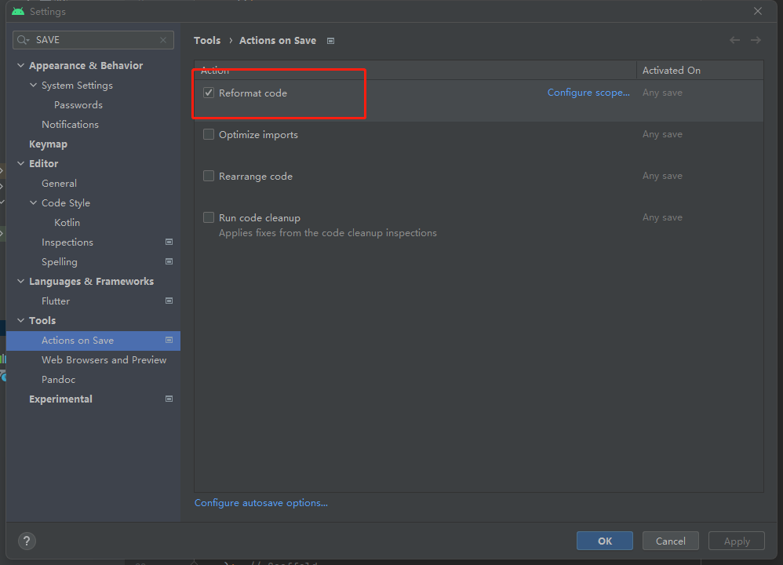
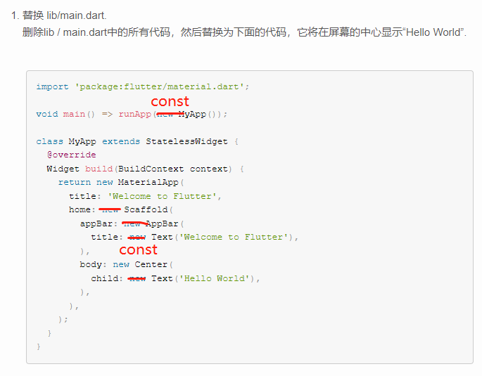
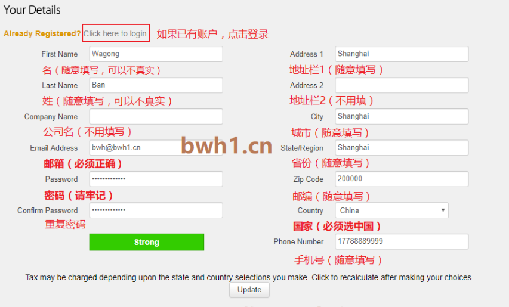
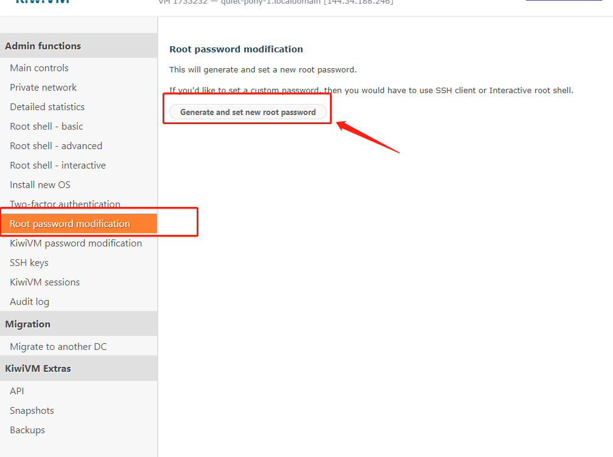
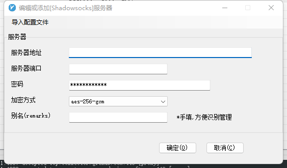
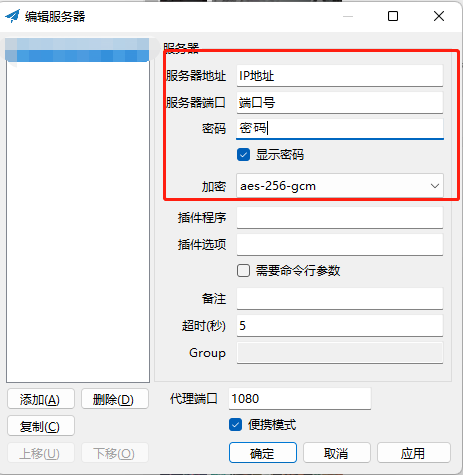

# Flutter Study Notes (Flutter 学习助手)

## 写在前面

> 此文档内容为： <b>在 Windows 系统中使用 Android Studio 进行 Android 应用开发流程</b> 的学习助手文档  整合了本人在学习开发中遇到的 <b>问题及解决方案</b>，也许对你有所帮助 
> 主要学习途径： [Flutter 中文网](https://flutterchina.club/) 
> 开发过程很多资源需要访问外网，所以<b>需要一个稳定的代理</b>！！！ 如果没有稳定代理可以看这里: [(Q: 如何搭建自己的稳定代理？)](#Q1)

 

---

 

---

## 1. 安装

参考[<u>官方中文文档</u>](https://doc.flutterchina.club/setup-windows/)，不赘述。

> 说说可能遇到的问题： 
>
> 1. 检查 Android SDK 环境变量路径是否正确<b>（Android SDK 需要占用大量空间，建议不要装在默认的 C 盘中）</b>
> 2. Android SDK missing command line tools:
>    > Android Studio - Tools - SDK Manager - SDK Tools - (选择安装) Android SDK command-line Tools
> 3. 无法下载 gradle 问题， 设置 proxy: File - Settings - HTTP Proxy <b>添加本地代理</b>
> 4. 添加代理后仍无法下载问题： 
>    配置或删除 `C:\Users\***\.gradle\gradle.properties` 中的全局代理  ~~`systemProp.http.proxyHost=...`~~  ~~`systemProp.http.proxyPort=...`~~  ~~`systemProp.https.proxyHost=...`~~  ~~`systemProp.https.proxyPort=...`~~ 

 
 

---

## 1. 编写第一个 Flutter 应用

> 1. 为方便开发，先把保存自动格式化勾选上
>    
> 2. 这里的语法应该还是 dart1 的语法？实际编写过程中插件会警告或报错，关键字 <kbd>new</kbd> 可以省略，常量上下文使用 <kbd>const</kbd> 修饰。具体看这里：[> 高效 Dart 语言指南：用法示例](https://dart.cn/guides/language/effective-dart/usage#dont-use-new)  
> 3. english_words: ~~^3.1.0~~ 换成 ^4.0.0  
>    使用 v3.1.0 版本报错，在 [pub.dartlang.org](https://pub.dev/) 上搜索 [english_words](https://pub.dev/packages/english_words) 看到 4.0.0 版本开始是 <kbd>Null safety</kbd> 的版本。 Flutter2.2.0（2021 年 5 月 19 日发布） 之后的版本都要求使用 <kbd>Null safety</kbd>。 [> 了解什么是 Null safety](https://dart.cn/null-safety)

---

## FQA:

### 
1. Q: 如何搭建自己的稳定代理？

<em>简述：</em> 
<em>1. 购买一台香港/台湾或国外服务器</em> 

> [注册/购买搬瓦工教程](https://www.bandwagonhost.cn/register.html)   这里说说我注册中遇到的几个小问题： 
>
> 1. 首先我要有, 然后我才能 问题：访问这个网站需要翻墙，没有翻墙工具找个临时的，或者找人帮忙，或者选择购买国内服务商提供的香港/台湾/国外服务器 
> 2. 注册信息如何填写问题：  
> 3. 服务器账号名是 root, 密码点这里 ↆ   

<em>2. 服务器安装 shadowsocks</em> 

> \# 1. 服务器安装 wget <code>yum install wget</code>  \# 2. 安装 shadowsocks  `wget –no-check-certificate -O shadowsocks.sh https://raw.githubusercontent.com/teddysun/shadowsocks_install/master/shadowsocks.sh`  \# 3. 获取 shadowsocks.sh 读取权限   > <code>chmod +x shadowsocks.sh</code>  \# 4. 设置密码和端口号及加密方式（加密方式使用默认即可）  <code>./shadowsocks.sh 2>&1 | tee shadowsocks.log</code>  \# 5. 安装完成后会显示 IP 地址&端口号&密码&加密方式，做好记录后，<b>重启系统</b>！

<em>3. 安装客户端工具</em>

> 下载其中一个客户端工具解压即可：  [V2rayN 安装包](https://github.com/2dust/v2rayN/releases) 
> 配置:      [shadowsocks 安装包](https://github.com/shadowsocks/shadowsocks-windows/releases) 
> 配置：  

<em>4. 开心上网</em> 

> \> [完整参考：购买搬瓦工服务器 + Shadowsocks 搭建个人服务](https://github.com/clown-coding/vpn)  
